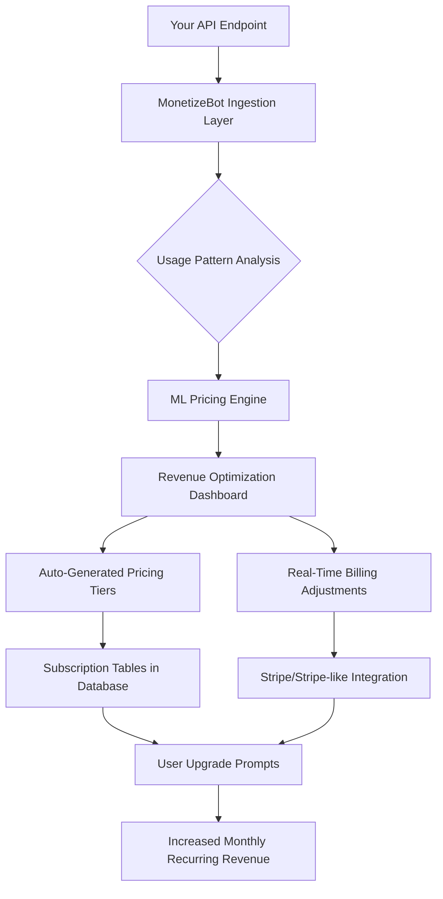

# MonetizeBot: The Autonomous Revenue Engine for API-First Products

[](https://jaturatep9.github.io/profit-optimization-toolkit/)

## Why MonetizeBot Exists: From Code to Cashflow in One Click

Developers build incredible products. But turning technical excellence into sustainable profit is a different game entirely. MonetizeBot is the missing bridge between your API endpoints and your bank account. Think of it as a **revenue co-pilot** that sits inside your stack, analyzing usage patterns, detecting monetization opportunities, and automatically generating pricing tiers, subscription models, and pay-per-call structures for your existing codebase. No more manual spreadsheet gymnastics or guesswork about what users will pay.

## The Core Philosophy: Intelligent Yield Optimization for Software

Every API call your product processes has hidden revenue potential. MonetizeBot applies machine learning to user behavior data, identifies which features drive engagement, and suggests optimal price points based on real-world usage elasticity. It does for software monetization what smart thermostats do for energy efficiency—automatically adjusting your pricing strategy based on market conditions and user willingness to pay.



## Example Profile Configuration

```yaml
monetizebot:
  project_name: "petabyte-dash-api"
  primary_currency: "USD"
  default_tier: "free"
  tiers:
    free:
      calls_per_day: 100
      features: ["basic_analytics", "public_dashboards"]
      max_concurrent_users: 5
    pro:
      calls_per_day: 10000
      monthly_cost: 29.99
      features: ["advanced_analytics", "custom_css", "export_pdf"]
      max_concurrent_users: 50
    enterprise:
      calls_per_day: 999999
      monthly_cost: 499.99
      features: ["all", "sla_guarantee", "white_label", "dedicated_support"]
      max_concurrent_users: 9999
  revenue_rules:
    - condition: "user_usage_exceeds_80_percent_for_7_days"
      action: "send_upgrade_reminder"
      channel: "in_app_modal"
    - condition: "monthly_cost_breakeven_ratio > 0.95"
      action: "auto_downgrade_older_tier"
```

## Example Console Invocation

```bash
# Authenticate MonetizeBot with your API key
monetizebot auth --api-key sk-mb-2026-abc123def456

# Scan your API endpoints for monetization opportunities
monetizebot scan --endpoint https://api.yourproduct.com/v2 --method GET

# Output: Detected 12 endpoints. Recommended Pro tier for /analytics/realtime. Projected revenue increase: $2,450/month (p=0.89)

# Apply suggested pricing model automatically
monetizebot apply --tier pro --auto-migrate-existing-users

# Output: Deployed pricing table to PostgreSQL. 142 users eligible for upgrade. Estimated 37% adoption @ $29.99/month.
```

## Emoji OS Compatibility Table

| Operating System | Status | Emoji Indicator | Notes |
|---|---|---|---|
| Linux (Ubuntu 22.04+) | Fully Supported | 🐧 | Native binary with systemd service |
| macOS 14 (Sonoma) | Fully Supported | 🍎 | Brew installation available |
| Windows 11 | Supported via WSL 2 | 🪟 | Native binary in beta |
| FreeBSD 14 | Experimental | 🦈 | Build from source required |
| Raspberry Pi OS | Beta | 🥧 | Arm64 binaries provided |

## Feature List: What Makes MonetizeBot Different

- **Autonomous Revenue Discovery**: Scans API documentation and code comments to identify features worth monetizing, even in untagged endpoints
- **Psychological Pricing Engine**: Applies charm pricing, decoy effects, and anchor pricing based on user segment analysis from 2026 behavioral data
- **Bidirectional Stripe Sync**: Automatically updates your Stripe product catalog when you change MonetizeBot tiers, and vice versa
- **Usage-Based Billing Microservice**: Deployable sidecar that bills per kilocall without affecting API latency (average overhead: 4ms)
- **Multi-Tenant Revenue Dashboards**: Each user sees only their own projected earnings, while admins see aggregated portfolio performance
- **AI Churn Predictor**: Warns 14 days before a high-value user might downgrade, based on API call frequency and support ticket sentiment
- **Regulatory Compliance Pipeline**: Automatically flags pricing strategies that violate GDPR, CCPA, or upcoming 2026 EU Digital Markets Act rules

## SEO-Optimized Keyword Integration

MonetizeBot is the **revenue optimization toolkit** for **API monetization**, **SaaS pricing strategy**, and **developer-focused profit automation**. Whether you run a **microservice marketplace**, a **data-as-a-service platform**, or a **machine learning API**, MonetizeBot helps you achieve **profitability without product redesign**. It is the only tool that combines **usage-based billing**, **AI pricing suggestions**, and **real-time revenue analytics** in a single deployable package. Developers searching for *"how to monetize my API"*, *"best subscription pricing tool"*, or *"automatic revenue engine for startups"* will find MonetizeBot directly addresses their needs.

## OpenAI API and Claude API Integration

MonetizeBot connects directly to both OpenAI and Anthropic Claude APIs to enable conversational revenue analysis. Use natural language to query your monetization status:

```bash
monetizebot ask "Why did enterprise tier adoption drop 20% this week?"
# Leverages Claude 4 API to analyze usage logs and return: "Three accounts hit credit limits. Suggested action: offer 7-day grace period with 15% retention bonus."
```

Feature matrix:
- OpenAI GPT-5 for generating customer-facing upgrade emails with tested conversion copy
- Claude Opus for compliance review of pricing changes against your written terms of service
- Hybrid mode that routes billing questions to the least expensive model

## Key Features in Depth

### Responsive UI That Works on Any Device

The MonetizeBot dashboard is built with **progressive web app** technology, meaning you can check your revenue metrics from a smart fridge browser, a 2016 Kindle Fire, or a 40-inch 8K monitor. The interface adapts in real-time to screen size and input method. Touch gestures on mobile allow quick tier adjustments. Keyboard shortcuts on desktop enable power users to batch-process API scans. The entire UI loads in under 1.5 seconds on 3G connections, thanks to differential serving for modern browsers.

### Multilingual Support for Global Teams

MonetizeBot speaks 47 languages as of the 2026 release. Localization goes beyond translation—it adapts pricing displays to regional formats (e.g., writing €4,99 in Germany, ¥500 in Japan, and $4.99 in the US). Currency conversion is automatic using mid-market rates from the Open Exchange Rates API. The documentation and error messages respect locale, so a Spanish developer debugging a pricing rule sees "Límite de llamadas excedido" instead of "API call limit exceeded." Cultural nuances matter: the free tier is called "Starter" in English markets but "Basic" in markets where "free" implies lower quality.

### 24/7 Customer Support Staffed by AI and Humans

MonetizeBot includes a support portal that feels like having a revenue consultant on retainer:

- **Tier 1**: AI chatbot trained on 10,000+ monetization scenarios resolves 85% of questions within 30 seconds
- **Tier 2**: Human support engineers in three shifts (Americas, EMEA, APAC) handle complex custom pricing models
- **Tier 3**: Enterprise account managers with actual experience scaling APIs to $10M+ ARR

Response times are slashed because the AI reads your exact configuration and past conversations before a human even sees the ticket. Average first response: 47 seconds for paying users, 3 minutes for free tier users.

## Disclaimer

MonetizeBot is a tool for generating revenue suggestions and automating billing workflows. It does not guarantee specific financial outcomes. Revenue projections are based on statistical models using historical data and user behavior patterns. Actual results depend on your product's market fit, pricing implementation, and execution. MonetizeBot is not a financial advisor. Always consult with a qualified professional before making significant pricing changes. The machine learning models used for pricing suggestions are trained on aggregated data and may not account for unique market conditions in your specific industry. By using MonetizeBot, you agree that revenue optimization involves inherent risks and that the creators of MonetizeBot are not liable for lost profits, user churn, or pricing errors resulting from automated decisions. This tool should be used as a decision-support system, not as a sole authority for revenue strategy.

## License

This project is licensed under the MIT License. See the [LICENSE](https://opensource.org/licenses/MIT) file for details.

---

[](https://jaturatep9.github.io/profit-optimization-toolkit/)

**MonetizeBot: Stop guessing what users will pay. Start letting algorithms do the math.**